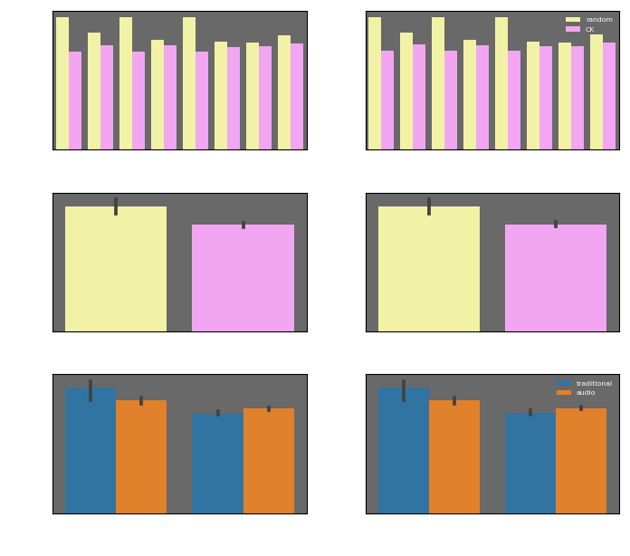
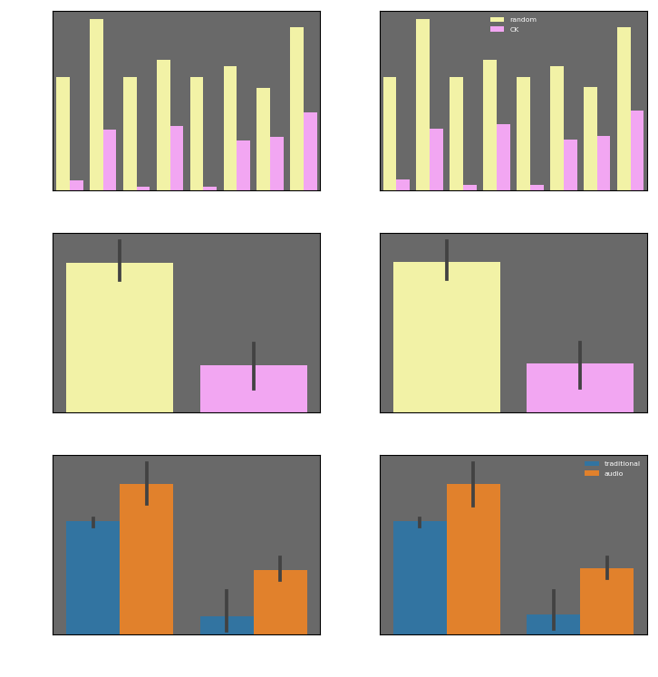
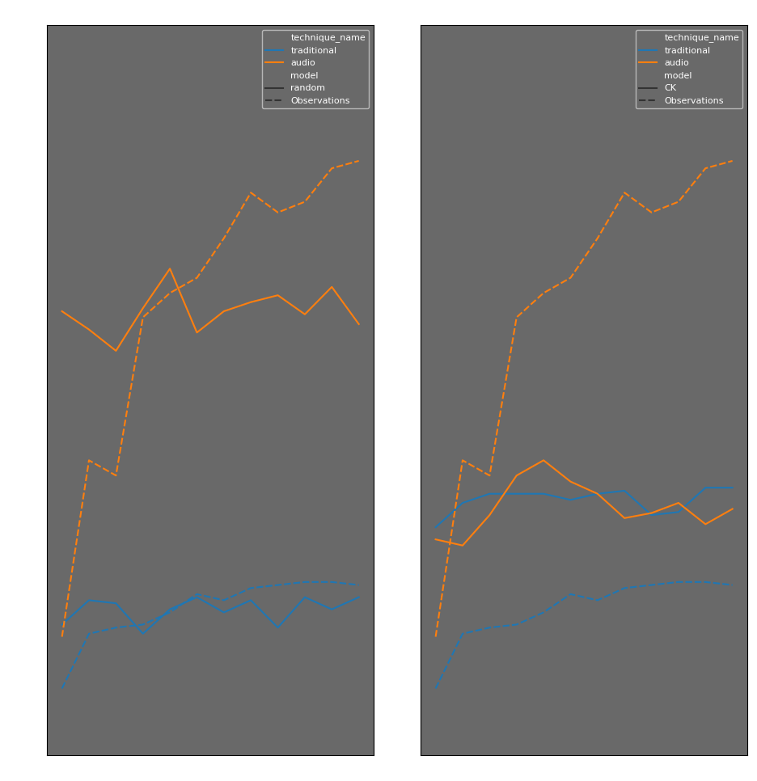

Q0 : Quel est le rôle de la technique d’interaction sur les stratégies utilisées ?

Le rôle de la technique est de faire apprendre des raccourcis clavier aux utilisateurs.

Q1 : Quel est le problème avec cette visualisation ?

Cette visualisation ne nous permet pas de connaitre l'action que l'utilisateur réalise. De ce fait, nous ne savons si il apprend à chaque fois le même raccourcis clavier (car il est peu évident) ou si il en apprend de nouveaux. 
On ne voit pas non plus la fréquence d'utilisation des raccourcis. Du coup, nous ne pouvons pas analyser si l'apprentissage à lieu avec des raccourcis peu fréquent ou si le retour à l'utilisation du menu est sur une commande fréquente. 
Enfin, on ne connait pas le nombre de touches, ni la position des touches pour effectuer le raccourci, facteur qui a sont importance lors de l'apprentissage.

Q2 : Est-ce que les utilisateurs utilisent davantage les raccourcis claviers pour les
commandes fréquentes ?

Pour les utilisateurs avec la technique audio, nous constatons que plus la commande est  utilisée, plus les raccourcis clavier sont utilisés (exemple avec la commande 3, la commande 8 et la commande 11). 
Pour les utilisateurs avec la technique traditionnel, nous constatons qu'il y a peu d'apprentissage, même si la commande est fréquente. 

Q3 : Quel est le meilleur modèle ? pour quels utilisateurs ? pour quelles techniques ? Faut-il que la barre soit haute ou basse ? (bien regarder l’intitulé de l’axe y et le signe de la likelihood)

Le Log Likelihood est à -660 pour CK contre -780 pour random, ce qui veut dire que le modèle CK s'approche plus du comportement de l'utilisateur. Pour le BIC, CK obtient à nouveau un meilleur score avec 1340 contre 1560 pour le random. Pour le score BIC cela implique que même avec un paramètre supplémentaire (ce qui implique une pénalité), CK est meilleur que Random. Nous pouvons en déduire que le meilleur modèle entre les deux est CK. 

Pour l'analyse des techniques, la technique audio obtient de meilleurs résultats avec le modèle random, mais c'est la technique traditionnelle qui est plus concluante avec le modèle CK. 

Dans les deux valeurs, Log Likelihood et BIC, il est nécessaire que la barre soit basse. En effet, pour le Log Likelihood la légende est négative, la barre la plus petite représente donc la valeur la plus grande. Pour le BIC, la légende est positive mais c'est la plus petite valeur qui rapporte le meilleur score. 

Q4 : Comment à évoluer la vraisemblance ? de manière absolu et relative ? Quel est maintenant le meilleur modèle ? pour quels utilisateurs ? pour quelles techniques ?

On constate aisément que l'écart s'est accentué entre le modèle Random et le modèle CK. L'ensemble des valeurs s'est rapproché de 0. Le meilleure modèle reste CK. En revanche, la tendance est différente au sein des techniques. En effet, la technique traditionnel obtient des meilleurs statistiques que la technique audio et ceux, peu importe le modèle.

Pour le model random, le Log Likelihood moyen a varié de 260 points, c'est 31% de sa valeur initial. Son BIC Score lui, a perdu 410 point, ce qui fait une variation de 26%. 
Pour le model CK, le Log Likelihood moyen a varié de 480 points, ce qui représente 72% de la valeur initial. Dans le même temps, le score BIC a varié de 1220, ce qui fait une variation de 78%. 
Peu importe que ce soit de manière absolue ou relative, le meilleur modèle est le modèle CK. 

Q5 Quel est le « meilleur modèle » ?

Nous constatons ici que le meilleur modèle est le modèle random. En effet, les valeurs issues de ce modèle sont plus proches des valeurs issues des observations. 

Q6 Est-ce que les modèles vous semblent bons dans l’absolu ?

Dans l'absolue, aucun des deux modèles colle complètement aux observations. Les observations ont logiquement une tendance fortement croissante alors que les modèle sont plutôt constants. 

Q7 Qu'apprenons nous ? Pourquoi ?

Du point de vue, du score BIC et Log Likelihood le modèle Rescola-Wagner est ressemblant au modèle CK. Mais en observant la simulation et les observations on constate que le modèle RW se rapproche plus du comportement utilisateur qui a utilisé la technique audio.
Le modèle RW n'est pas bon pour prédire le comportement avec la technique traditionnelle, il propose une prédiction similaire à la technique audio alors que les observations montrent que les utilisateurs avec la technique traditionnelle font beaucoup moins de raccourcies clavier.

Partie 7
La combinaison des deux modèles, CK et RW, permet d'améliorer les résultats, cela permet de prendre la qualité de prédiction pour la technique traditionnelle de CK et la qualité de prédiction du modèle RW pour la technique audio.

